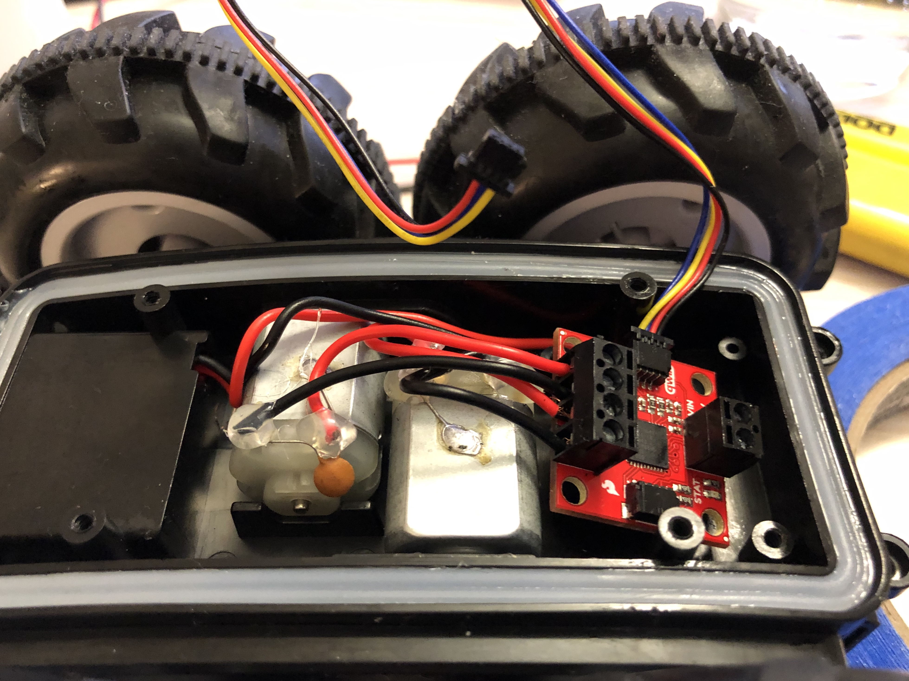

# Objective

The purpose of this lab is to take our robot apart and install the motor driver so we can control the motors directly using our Artemis board. We also explore the option to control the virtual robot that we set up in [lab 3](../lab3.md) via Python in Jupyter Notebook.

# Tasks

## A. Physical Robot

### Wiring

After removing the control PCB and cutting off all the wires, I had to strip the wires using a wire cutter since I don't have a wire stripper. This turned out to be pretty difficult, especially since the wires are stranded and easy to cut through. Following the [hookup guide](https://learn.sparkfun.com/tutorials/hookup-guide-for-the-qwiic-motor-driver) for the motor driver, I then connected all wires to the motor driver, including \\( V_{in} \\) and \\( GND \\) from the battery and the four terminals for the two motors. The inside of the car looks like this after all wiring.

<center></center> 

### Calibration

### Open Loop Control

## B. Virtual Robot

For this part of the lab, we run the setup script from the lab 4 base code and start ```lab4-manager``` as well as a Jupyter Notebook server that allows us to control our virtual robot by setting its linear and agular velocity using Python. Since we have access to Python, we have much better control of the robot in terms of timing and setting the exact velocities, which means having the robot traverse a square is incredibly simple.

<center><video autoplay loop muted inline width="800"><source src="/ECE4960/assets/videos/lab4/simulation.mp4"></video></center>

The code that controls the motion of the robot is shown on the right. From [lab 3](../lab3.md), we know that the maximum angular velocity that the robot can handle is \\( \frac{\pi}{2}\,rad/s \\), which is why setting the angular velocity to 2 effectively makes it rotate \\( 90^{\circ} \\) every second. The linear velocity is also set at 2, which forces the robot to travel at its maximum linear velocity, \\( 1m/s \\)It therefore unrealistically follows a perfect square.
